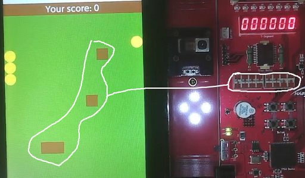
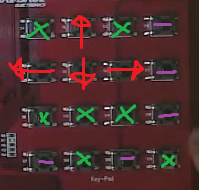
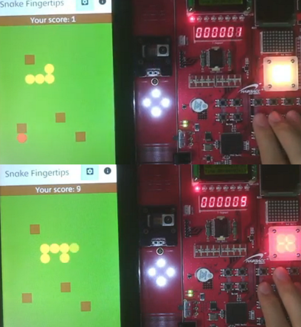
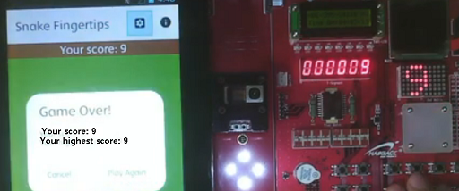

# SnakeGame-Android

## Introduction
This is mobile system programming with a smart tablet device board.

It uses custom hardware on the right-hand side of the board (FPGA board)

To reduce development time, I forked [SnakeGame-Android](https://github.com/YangDai2003/SnakeGame-Android) and did work on it.

I focused hardware control part than software.

I used JNI to call C/C++ function to control fpga devices.

[Demo YouTube clip](https://youtube.com/watch?v=HBxpRqMa0Ok)

## Features

### LED
The snake's length is synchronized with the number of led turned on.

Since snake's default length is 3, the number of led turned on is determined on `length - 3`.

### 7-segment
7-segment LEDs display current score.

### Dip switch
The number of dip switch on is synchronized with the number of barrier blocks. (But when you enter setting page, it is automatically set to two of multiple. That's why the number of barrier blocks 4 mismatches the number of dip switch on 5 in the picture. Anyway, it's not a big deal.)

### Keypad
The keypad is the main controller of snake. The other keys is not recognized by device driver(-), or its behavior is undefined(x).

### Full Color LED
- It becomes red whenever the snake eats red food.

- It becomes yellow whenever the snake eats yellow food.

### Dot Matrix
It displays the user's high score if all following conditions are true:
- Previous highscore is less than current score. That is, the user recorded new high score.
- Game over.

## For successors

### Serial port is unnecessary
Serial port connection is not necessary for app development! Just connect only power supply and USB OTG cable on your PC and type `adb shell` in cmd to access shell of the device.

### INSTALL_FAILED_INSUFFICIENT_STORAGE
#### Problem
The most common error I've seen in running app process in Android Studio is `INSTALL_FAILED_INSUFFICIENT_STORAGE`. This is because `/data` directory has insufficient storage. You can check how free space is left by command `df -h` in adb shell. I took a plenty of time to solve this. [stackoverflow](https://stackoverflow.com/questions/4709137/solution-to-install-failed-insufficient-storage-error-on-android) was not helpful. I also tried remount file system to exchange between `/data` and `/cache` because file system mounted on `/cache` has more storage. It did not work as I expected, well.

#### Solution
SD card has enough storage. You can set install location to SD card by type `adb shell pm set-install-location 2`. (If you are already in the shell, just type `pm set-install-location 2`.) I got this information from [stackoverflow](https://android.stackexchange.com/questions/43517/installing-to-sdcard-by-default).

### INSTALL_FAILED_DEXOPT

If you set install location to SD card, you may see `INSTALL_FAILED_DEXOPT` error. [stackoverflow](https://stackoverflow.com/questions/23461138/failure-install-failed-dexopt) says that "The most common cause of the problem is dex limits on android". I interpreted this sentence as "There must be only one application at time". Before installing the app, you can type `adb uninstall <your package name>` to avoid DEXOPT error. For example, in this project, I typed `adb uninstall com.yangdai.snakegame` before every installation. It is a little pain.

### Full color LED parameters formula
When you call FLEDControl method in FLED class, you should resize the RGB value to make it belongs to interval [0, 100]. That means, you should multiply each arguments with `100 / 255`. For example, if yellow's RGB value is (255, 242, 0), you should pass arguments as (100, 94, 0). **Honestly, I do not know that this logic is true way to pass arguments**, but this logic is applied and seemed working well, at least in this project.

## Build and Deployment Process
I accessed the ARM architecture cross-compilation environment provided by the professor via SSH to review and modify code related to the Android and FPGA board. On the server, I cross-compiled the Linux kernel and U-Boot bootloader, then built the Android system image, initial RAM disk, and recovery image, downloading them to my PC. The U-Boot, kernel image, and initial RAM disk were written to an SD card and inserted into the FPGA board, while the Android system image and recovery image were flashed to the FPGA board’s flash memory using Fastboot. Using PuTTY’s serial console, I configured boot environment variables in the U-Boot prompt, such as memory start address, kernel load location, and root filesystem location. After rebooting the FPGA board, I monitored the kernel loading and Android system initialization process, then tested basic Android and hardware functions upon boot completion. This process ensures hardware-software integration and serves as a reference for successors to replicate or debug the system.

## Limitations

I also tried to control OLED and TextLCD devices, because I wanted to cover as much as possible devices. It seems that OLED is broken or source code has a bug. And TextLCD does not work properly even though I referenced source code in the book. I don't know why.

## Hardware specifications
- Hanback Electronics SM5 S4210 M3
- Android 4.1 ("Jelly Bean") | arm
- API: 16
- Type: Physical
