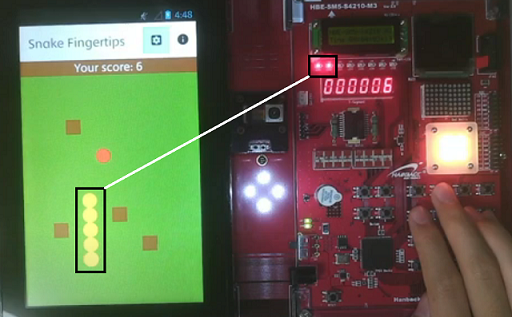
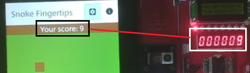

# SnakeGame-Android

## Introduction
This is mobile system programming with a smart tablet device board.

It uses custom hardware on the right-hand side of the board (FPGA board)

To reduce development time, we forked [SnakeGame-Android](https://github.com/YangDai2003/SnakeGame-Android) and did work on it.

We focused hardware control part than software.

We used JNI to call C/C++ function to control fpga devices.

[Demo YouTube clip](https://youtube.com/watch?v=HBxpRqMa0Ok)

## Features
The snake's length is synchronized with the number of led turned on.

Since snake's default length is 3, the number of led turned on is determined on `length - 3`.

7-segment LEDs display current score.

